# MercadoLibre-Prophet-Forecasting

 ## Time Series Analysis with Prophet 

Mercadolibre is the largest ecommerce and payments ecosystem in Latin America enabling users easier and better ways to pay and sell with the purpose of democratizing commerce and payments in the region.

By using company's financial and user data this analysis aims to find ways to make the company grow.One of the way of doing this is by finding out if the ability to predict search traffic can translate into the ability to successfully trade the stock.

This analysis also includes a forecast of the companay's revenue for the next quarter using time series models in order to increase their ability to plan budgets and to help guide expectations for the company investors.

This repo consists a Jupyter notebook that contains the following:

* Visual depictions of seasonality (as measured by Google Search traffic) that are of interest to the company.

* An evaluation of how the company’s stock price correlates to its Google Search traffic.

* A Prophet forecast model that can predict hourly user search traffic.

* A plot of a forecast for the company’s future revenue.

## Technologies
This project runs on python 3.7 and includes the following libraries and dependencies:

* pandas 
* holoviews 
* prophet 
* hvplot
* datetime 
* numpy 
* %matplotlib inline
* Google Colab
* Jupyter Notebook

## Installation Guide

To use the application you need to install the following dependencies.

```python
!pip install pystan
!pip install prophet
!pip install hvplot
!pip install holoviews

``` 
---

### Usage

To use this application just clone the repository on Google Colab and run the provided code in the Install and import the required libraries and dependencies section.

* The first cell will install the necessary libraries into the Google Colab runtime.

* The second cell will import the dependencies for use in the notebook.

Upon launching the application  on Colab  run the file by clicking on the play button on the left of the each cell of the notebook. 

---

## Usage Examples

## Find Unusual Patterns in Hourly Google Search Traffic

  Does the Google search traffic for the company links to any financial events at the company Or the search traffic data just present random noise?

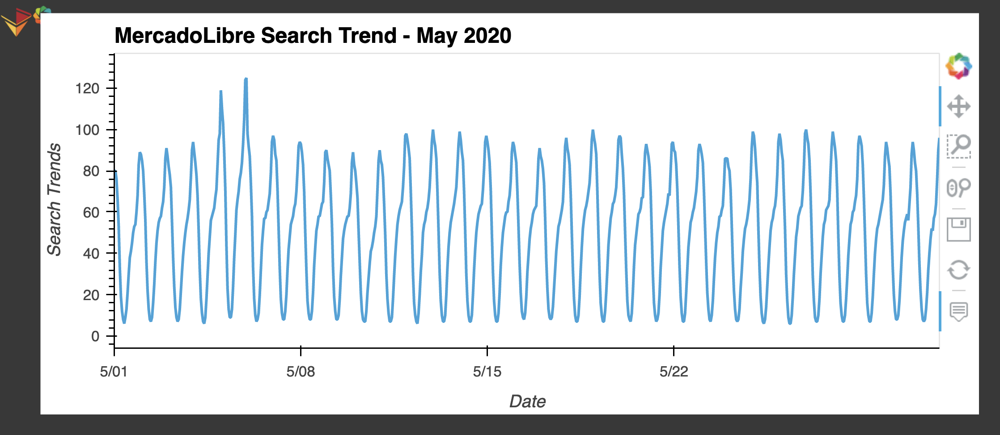

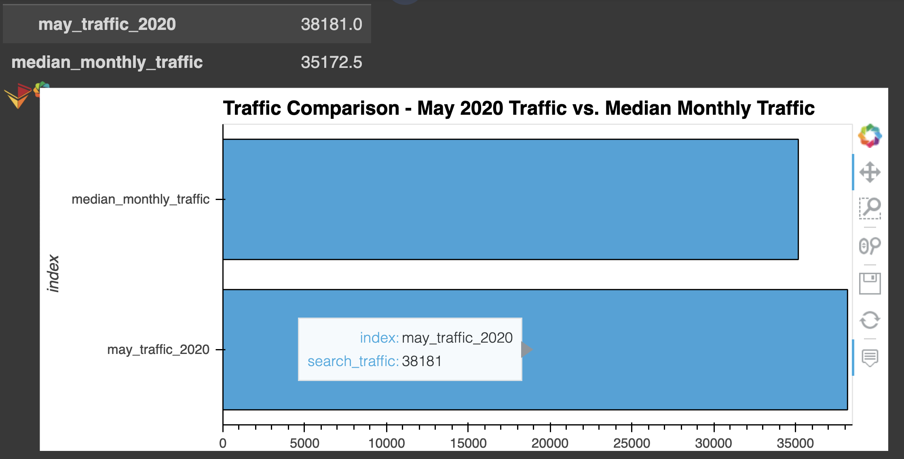

By comparing the value of google search traffic during May 2020 with the overall monthly median value (From the visual) we can observe that traffic increasd in May 2020 when MercadoLibre released its financial results.

## Mine the Search Traffic Data for Seasonality

In order to get a greater return on investment from their marketing budget they can focus their marketing efforts around the time that have the most traffic.

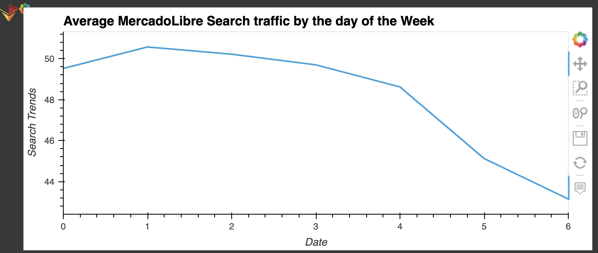

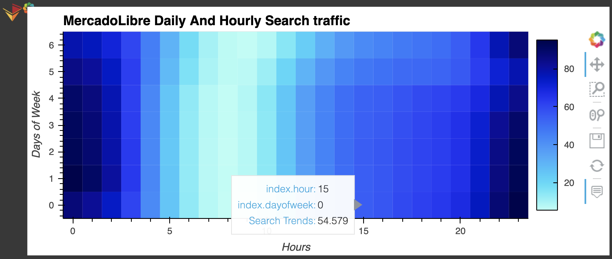

There is a high search traffic almost every day of the week around midnight.Observing the map, colors are more concentrated from 11:00 pm to 1:00 am which means people were actively serching about MercadoLibre around that time.

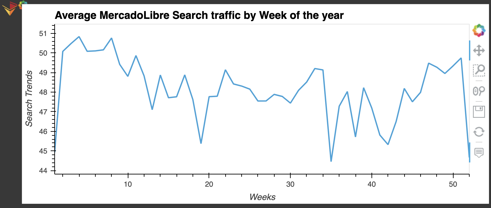

At the inception the 40th week, we can see a downward trend in the search traffic that continued until the 42nd but again it started to rise during thanksgiving at week 47 and after a slight dip again rose during winter holiday.After week 51 a sharp decline can be clearly seen.

## Relate the Search Traffic to Stock Price Patterns


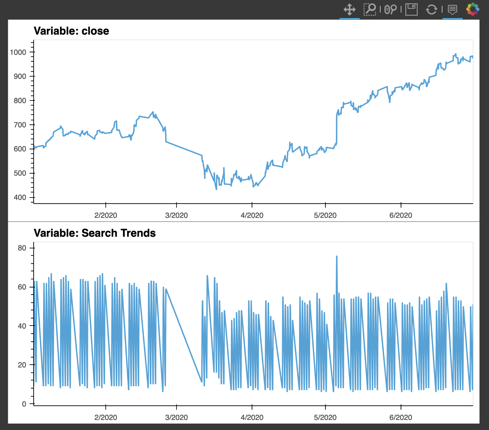

Both the visuals are showing the same trend that is consistent throughout the period which proves the existance of relationship between the search trends and the company stock price.A sharp decline can be seen in both the visuals from Feb 25,2020 to March 11, 2020 where share value and search trends are declining.Again on May 5, 2020 when MercadoLibre released its quarterly financial results there was a spike in both the price and the searching trend.

* Does a predictable relationship exist between the lagged search traffic and the stock volatility or between the lagged search traffic and the stock price returns?

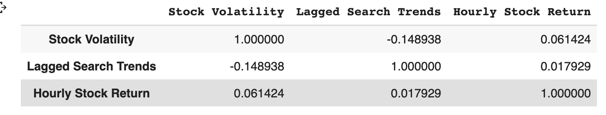

A negative correlation(-0.148938) exist between lagged search traffic and stock volatility which means they are inversely related. As the search traffic for MercadoLibre increases, the volatility of MercadoLibre stock tend to decrease following week.

Again,lagged search traffic and the stock price returns are showing a positive correlation(0.061424). Although the effect is small, an increase in the search traffic for MercadoLibre tends to precede higher returns for MercadoLibre stock.

##  Create a Time Series Model with Prophet

How's the near-term forecast for the popularity of MercadoLibre?

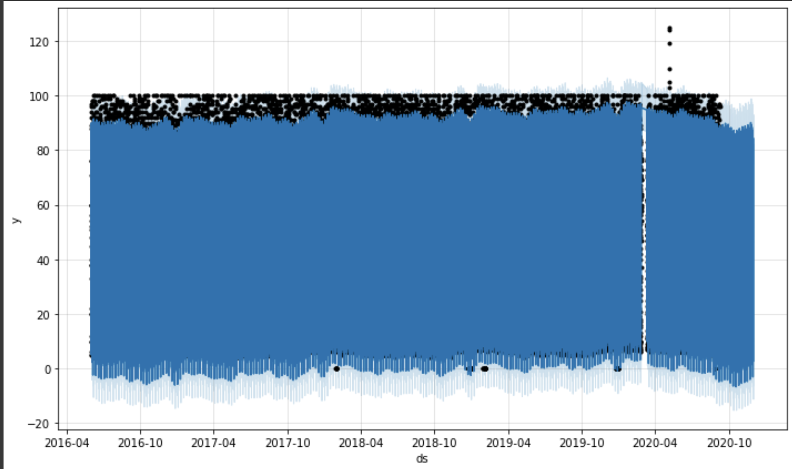


The Prophet forecast is showing a dip in the popularity of MercadoLibre around October 2020 for a while and again will try to catch up but this doesn't seem very accurate.

### Time Series Componenet ###

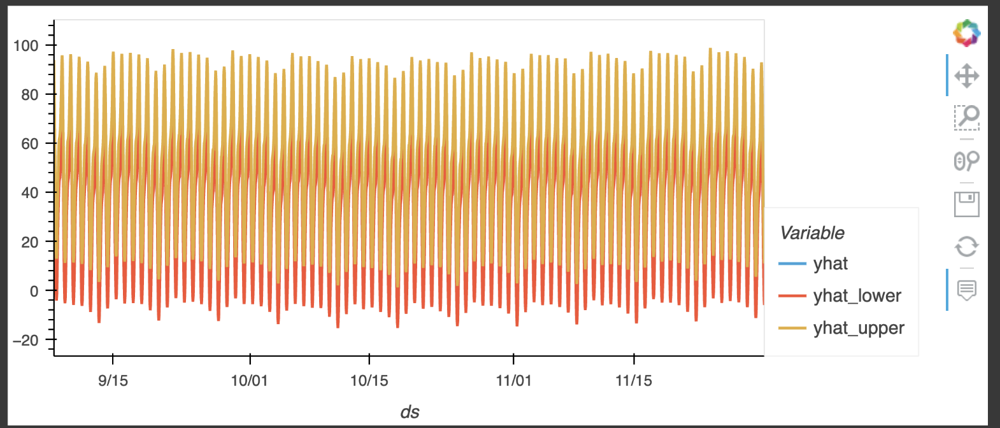

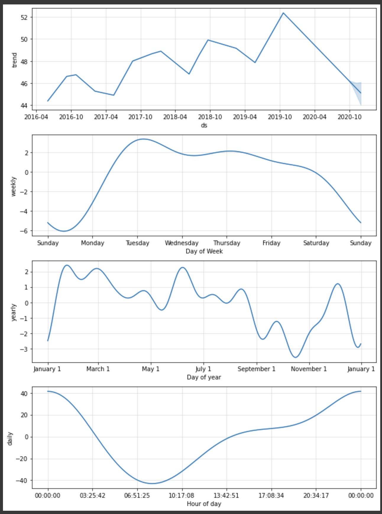

## Forecast Revenue by Using Time Series Models

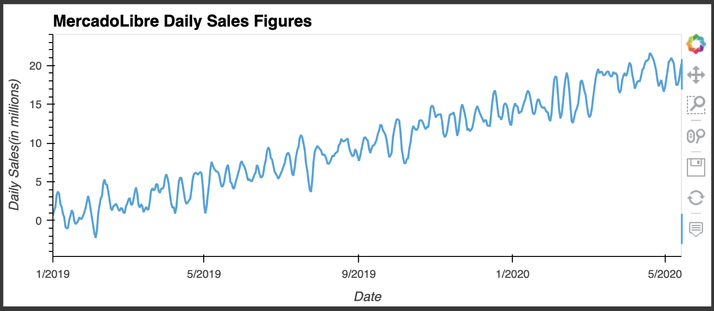

* Seasonal Patterns

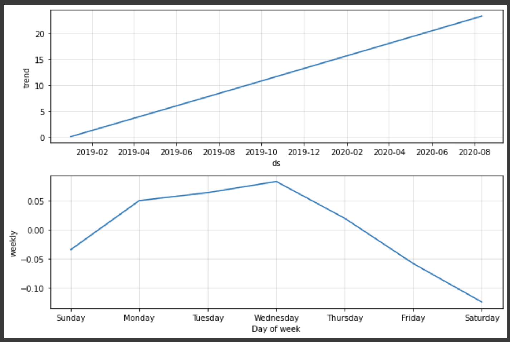

The sale starts to pick up from Sunday and reaches to its peak on Wednesday and again starts declining until saturday. Wednesday is the highest revenue day.

* Sales Forecast

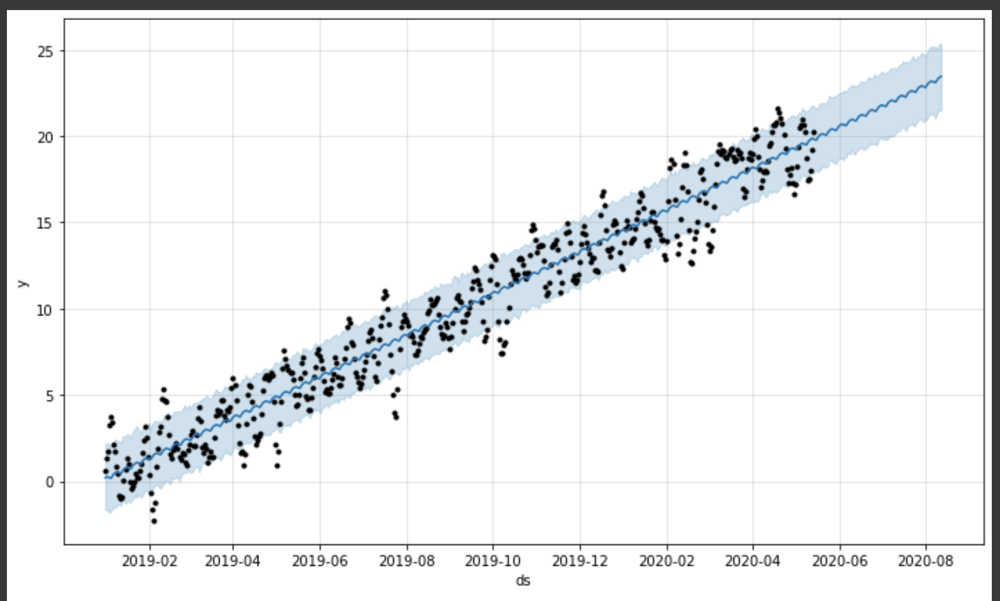

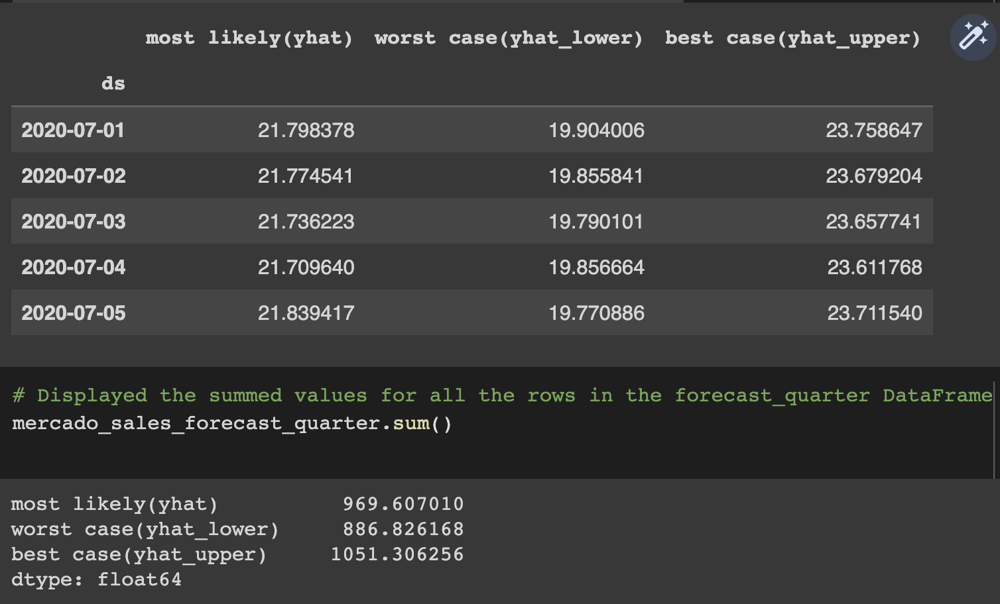

Based on the sales forecast it's most likely that the company will make 969.60(in millions) USD in the next quarter. In the best case scenario they are likely make 1051.09(in millions)USD and they will be able to make 887.95(in millions)USD in worst case.

## Contributers

Manisha Lal

08/30/2022

manisha.lal.2009@gmail.com
___


## License

copyright 2022


